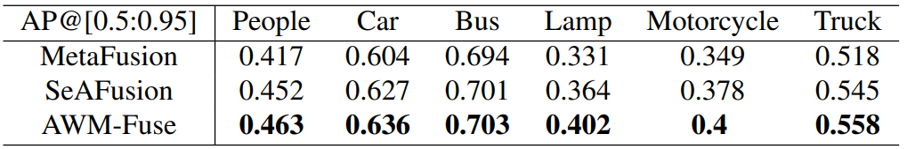

# Rebuttal For ICML2025 

<h1>Figure</h1>
<h2 id='figures'> Fig. 1: To Reviewer 7RSE, the modified flowchart.</h2>

<h2 id='figures'> Fig. 2: To Reviewer 7RSE, the modified experimental results in rain.</h2>

<h2 id='figures'> Fig. 3: To Reviewer 7RSE, the modified experimental results in snow.</h2>

<h2 id='figures'> Fig. 4: To Reviewer 7RSE, the modified experimental results in haze.</h2>

<h2 id='figures'> Fig. 5: To Reviewer sVxU and QUw9, the experimental results in standard scenarios (LLVIP, MSRS, M3FD).</h2>

<h2 id='figures'>Fig. 6: To Reviewer sVxU, examples of global and local text.</h2>

<h2 id='figures'> Fig. 7: To Reviewer QUw9, the experimental results in fog.</h2>

<h2 id='figures'> Fig. 8: To Reviewer duVQ and QUw9, the experimental results in real scenarios.</h2>

<h1>Table</h1>
<h2 id='tables'> Tab. 1: To Reviewer sVxU, the quantitative experimental results in standard scenarios (M3FD).</h2>

<h2 id='tables'> Tab. 2: To Reviewer sVxU, the quantitative experimental results in standard scenarios (MSRS).</h2>

<h2 id='tables'> Tab. 3: To Reviewer sVxU, the quantitative experimental results in standard scenarios (LLVIP).</h2>

<h2 id='tables'> Tab. 4: To Reviewer sVxU, CLIP global information ablation experiment in snow scenes.</h2>

<h2 id='tables'> Tab. 5: To Reviewer QUw9, different texts ablation experiments in snow scenes.</h2>

<h2 id='tables'> Tab. 6: To Reviewer duVQ, quantitative comparison with SeAFusion and MetaFusion for semantic segmentation.</h2>

<h2 id='tables'> Tab. 7: To Reviewer duVQ, quantitative comparison with SeAFusion and MetaFusion for object detection (AP@0.5).</h2>

<h2 id='tables'> Tab. 8: To Reviewer duVQ, quantitative comparison with SeAFusion and MetaFusion for object detection (mAP@[0.5 : 0.9]).</h2>

<h2 id='tables'> Tab. 9: To Reviewer duVQ, the quantitative experimental results in real scenarios (AWMM-100k).</h2>

